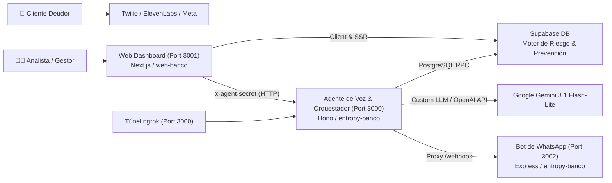

# Guía de Configuración y Ejecución End-to-End
## Bancoagrícola · Sistema de Cobranza Preventiva con IA
**Entropía Hack 2026**

Esta guía detalla el paso a paso exacto para configurar y levantar todo el sistema en cualquier computadora desde cero. El ecosistema consta de dos repositorios que trabajan juntos:

1. **`entropy-banco`** (Backend, Base de Datos Supabase, Agente de Voz/Orquestador, Bot WhatsApp).
2. **`web-banco`** (Frontend, Dashboard de Analítica y Gestión en Next.js 15).

---

## 🏛️ Arquitectura de Servicios y Puertos



| Servicio | Repositorio / Carpeta | Puerto | Propósito |
|---|---|:---:|---|
| **Agente de Voz / Orquestador** | `entropy-banco/apps/agent` | `3000` | Motor de turnos de voz, ElevenLabs Custom LLM, despacho de corridas, proxy de webhooks. |
| **Dashboard Web** | `web-banco/apps/dashboard` | `3001` | Interfaz de analítica, monitoreo en vivo, aprobación de promesas y ejecución de corridas. |
| **Bot de WhatsApp** | `entropy-banco/backend/whatsapp-hackathon-bot` | `3002` | Recepción de mensajes de WhatsApp y envío de enlaces de pago/cápsulas. |
| **Supabase Cloud** | Proyecto remoto | Cloud (5432 / HTTPS) | Base de datos PostgreSQL, RLS, cálculo de scoring preventivo y 15 migraciones. |
| **Túnel ngrok** | Terminal | `3000` | Exposición segura a internet para webhooks de ElevenLabs y Meta WhatsApp. |

---

## 📋 Prerrequisitos del Sistema

Instalar en la máquina (macOS, Linux o WSL2 en Windows):
* **Node.js**: Versión 20.9.0 o superior (recomendado Node 22 LTS).
  ```bash
  node -v  # Debe ser >= 20.9.0
  ```
* **pnpm**: Gestor de paquetes para la web (`web-banco`).
  ```bash
  npm install -g pnpm@12
  ```
* **Git**: Para clonar y sincronizar repositorios.
* **ngrok**: Para exponer el servidor local a internet (requerido para llamadas y WhatsApp en vivo).
  ```bash
  brew install ngrok/ngrok/ngrok  # macOS
  ```
* **Supabase CLI** (opcional, si vas a correr `supabase db push`):
  ```bash
  brew install supabase/tap/supabase
  ```

---

## PASO 1: Configurar y Levantar `entropy-banco` (Backend & Agente)

### 1.1 Clonar o situarse en el repositorio
```bash
cd /ruta/a/entropy-banco
npm install
```

### 1.2 Configurar variables de entorno (`.env`)
Crea el archivo `.env` en la raíz de `entropy-banco`:
```bash
cp .env.example .env
```
Edita `.env` con los siguientes valores esenciales:

```ini
# ── 1. Supabase (Obligatorio) ──────────────────────────────────────────
SUPABASE_URL=https://virurjsqumurwrayztcs.supabase.co
SUPABASE_SERVICE_ROLE_KEY=<SUPABASE_SERVICE_ROLE_KEY>
SUPABASE_PUBLISHABLE_KEY=<SUPABASE_ANON_KEY>
# Opcional si ejecutas scripts/db-push.sh:
SUPABASE_DB_URL=postgresql://postgres.virurjsqumurwrayztcs:<PASSWORD>@aws-0-us-east-1.pooler.supabase.com:5432/postgres

# ── 2. Google Gemini (Obligatorio para el LLM) ─────────────────────────
GEMINI_API_KEY=<TU_GEMINI_API_KEY>
GEMINI_OPENAI_BASE_URL=https://generativelanguage.googleapis.com/v1beta/openai/
SUPERVISOR_MODEL=gemini-3.5-flash-lite
SIMULATOR_MODEL=gemini-3-flash-preview

# ── 3. Servidor del Agente (Obligatorio) ──────────────────────────────
PORT=3000
# Genera una clave secreta cualquiera (ej: openssl rand -hex 24) y pon la MISMA en web-banco
AGENT_SHARED_SECRET=d6dca705b64b17d0e8300a9c6fa1e0070602e07182e04c64
PUBLIC_WEB_URL=http://localhost:3001
SIMULATE_CALLS=true
TEST_CUSTOMER_CODE=DEMO-001
TZ=America/El_Salvador

# ── 4. ElevenLabs & Telefonía (Opcional - si falta, se degrada a simulación con Gemini) ─
ELEVENLABS_API_KEY=
ELEVENLABS_AGENT_ID=
ELEVENLABS_PHONE_NUMBER_ID=
ELEVENLABS_WEBHOOK_SECRET=
CUSTOM_LLM_SECRET=miClaveCustomLLM

# ── 5. Correo con Resend (Opcional - si falta, se simula en logs) ─────
RESEND_API_KEY=
EMAIL_FROM=Bancoagrícola <notificaciones@tu-dominio.com>

# ── 6. WhatsApp & Twilio (Opcional para pruebas en vivo de mensajería) ─
TWILIO_ACCOUNT_SID=
TWILIO_AUTH_TOKEN=
TWILIO_WHATSAPP_FROM=whatsapp:+14155238886
META_VERIFY_TOKEN=tokenPrivadoHackathonBA
```

### 1.3 Validar la Base de Datos y Pruebas
Verifica que las migraciones y reglas de negocio pasen al 100%:
```bash
npm run db:test
# Debe imprimir:
# ✅ flow.sql: 38 aserciones
# ✅ prevention.sql: 33 aserciones
# OK: 71 aserciones pasaron
```

### 1.4 Levantar el Servidor del Agente de Voz (Terminal 1)
```bash
npm run agent:dev
```
* Abrirá en `http://localhost:3000`.
* Valida en tu navegador o terminal:
  ```bash
  curl http://localhost:3000/health
  # Devuelve: {"status":"ok","service":"@entropy/agent",...}
  ```

### 1.5 Levantar el Bot de WhatsApp (Terminal 2 - Opcional)
```bash
npm run bot:dev
```
* Escuchará en `http://localhost:3002`. El agente en el puerto 3000 reenvía automáticamente cualquier petición a `/webhook` hacia este bot.

### 1.6 Levantar el Túnel ngrok (Terminal 3 - Opcional para Webhooks)
Si vas a conectar ElevenLabs o Meta:
```bash
npm run tunnel
# O directamente: ngrok http 3000
```
Copia la URL pública HTTPS asignada (ej: `https://xxxx.ngrok-free.dev`).

---

## PASO 2: Configurar y Levantar `web-banco` (Dashboard Frontend)

El dashboard web está diseñado en Next.js 15 y se ejecuta en el **puerto 3001** para evitar colisiones con el agente en el puerto 3000.

### 2.1 Situarse en el repositorio e instalar dependencias
```bash
cd /ruta/a/web-banco
pnpm install
```

### 2.2 Configurar variables de entorno (`apps/dashboard/.env.local`)
Crea o edita el archivo en `apps/dashboard/.env.local`:
```ini
# Supabase (Lectura de clientes, analítica, KPIs y RLS)
NEXT_PUBLIC_SUPABASE_URL=https://virurjsqumurwrayztcs.supabase.co
NEXT_PUBLIC_SUPABASE_PUBLISHABLE_KEY=<SUPABASE_ANON_KEY>

# Conexión al Agente Backend (Servidor de voz y despacho de corridas)
AGENT_BASE_URL=http://localhost:3000
# IMPORTANTE: Debe coincidir exactamente con el AGENT_SHARED_SECRET de entropy-banco/.env:
AGENT_SHARED_SECRET=d6dca705b64b17d0e8300a9c6fa1e0070602e07182e04c64
```

### 2.3 Levantar el Dashboard en el Puerto 3001 (Terminal 4)
```bash
pnpm --filter @bancoagricola/dashboard exec next dev --hostname 127.0.0.1 --port 3001
```
* Abre tu navegador en: [http://localhost:3001](http://localhost:3001)

---

## PASO 3: Verificación del Flujo End-to-End

Una vez levantados ambos proyectos:

1. **Navega por el Dashboard ([http://localhost:3001](http://localhost:3001)):**
   * Visualiza el **Resumen general**: cartera en riesgo preventivo, mora evitada y distribución de clientes en Grados A a E.
   * Entra a **/riesgo**: verás los clientes priorizados por el algoritmo (`DEMO-001` Carlos Mendoza, `DEMO-002` María Santos, etc.).
2. **Iniciar una Corrida Preventiva desde la Web:**
   * Haz clic en el botón de **"Iniciar corrida"** en el panel web.
   * La web llamará por detrás a `POST http://localhost:3000/runs` con el secreto `x-agent-secret`.
   * El agente evaluará a los clientes, asignará el canal óptimo (Llamada para Grados C–E, Correo para A–B) y ejecutará la simulación de turnos o llamada real.
3. **Probar el Agente de Voz en Terminal (Modo Simulación):**
   * Puedes probar la conversación completa de un cliente sin gastar minutos de telefonía:
     ```bash
     cd /ruta/a/entropy-banco
     npx tsx apps/agent/src/scripts/test-custom-llm.ts DEMO-003 http://localhost:3000
     ```
   * Verás la transcripción SSE de turnos, evaluación del supervisor de compliance y registro de compromisos en Supabase en vivo.

---

## 🛠️ Solución de Problemas Frecuentes

| Problema | Causa | Solución |
|---|---|---|
| `Port 3000 is already in use` | Otro proceso o servidor quedó abierto en el puerto 3000. | Corre `lsof -ti:3000 \| xargs kill -9` y reinicia el agente. |
| Dashboard muestra error al pulsar "Iniciar corrida" | `AGENT_SHARED_SECRET` no coincide o `AGENT_BASE_URL` no está en `.env.local`. | Revisa que ambos archivos `.env` tengan el mismo `AGENT_SHARED_SECRET` y que el agente esté corriendo en `http://localhost:3000`. |
| `Cannot find module .../routes/voice.js` | Archivo residual tras la migración a ElevenLabs. | Asegúrate de tener el último commit de `main` (`git pull origin main`). |
| `Missing Supabase / Gemini envs` | Falta `GEMINI_API_KEY` o `SUPABASE_URL`. | Verifica que `.env` en la raíz de `entropy-banco` tenga las claves configuradas. |
